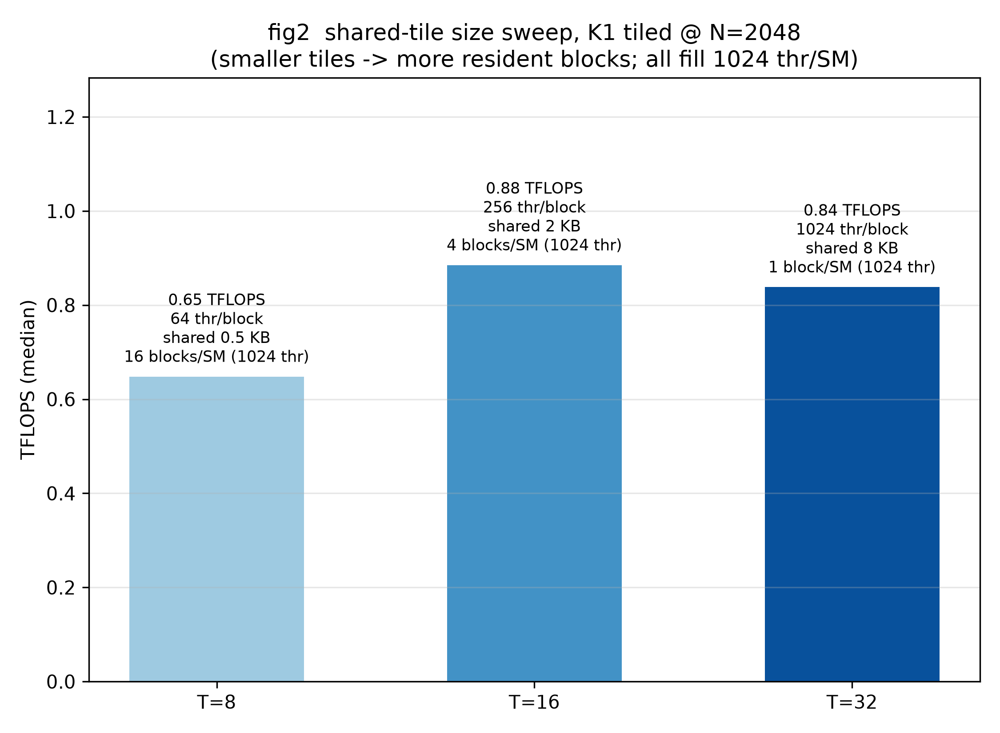
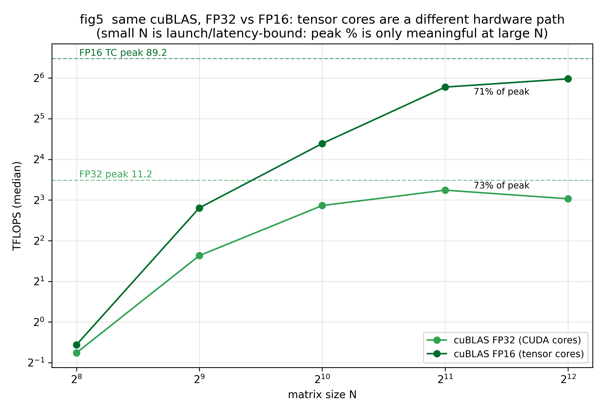

# AR002 gemm-lab 实验结果与分析

> 机器：Quadro RTX 5000（sm_75，48 SM，FP32 11.2 TFLOPS，FP16 TC 89.2 TFLOPS，HBM 448 GB/s，L2 4MB，shared 64KB/SM）
> 计时纪律：CUDA Event；每配置 3 遍 × 5 次 = 15 样本取**中位数**；每遍前 ~1s 持续 warmup（时钟爬坡）；复现性实测最差漂移 3.98%（<5% 门限）
> 数据：`results/bench_numba.json`（手写 kernel，numba CUDA）、`results/bench_torch.json`（cuBLAS 基线）；图在 `figs/`

## 0. 一页结论（数字卡）

| Kernel | N=2048 TFLOPS | 相对 K0@1024 | 达 FP32 峰值% | 机制一句话 |
|---|---|---|---|---|
| K0 naive（测至 N=1024） | 0.443 @1024 | 1× | 4.0% | 每输出直读 2N 个全局数，带宽地板 |
| K1 tiled T=16 | 0.885 | 2.0× | 7.9% | shared 复用，全局读降 16× |
| K2a regblock 32×32(2×2) | 1.357 | 3.1× | 12.1% | 寄存器累加器，shared→寄存器流量减半 |
| K2b regblock 64×64(4×4) | **2.036** | 4.6× | **18.2%** | 16 个累加器 + 更大 tile（AI=16） |
| cuBLAS FP32 | **9.468** | 21.4× | **84.5%** | 向量化装载+双缓冲+swizzle+调度 |
| cuBLAS FP16（tensor core） | 54.872 | 124× | 61.5%(FP16 峰值) | 硬件矩阵乘单元，另一条物理路径 |

（相对倍数以 K0@1024=0.443 为基；同 N 严格对比见 fig1/fig4。）

**三个断层**（严格同 N=1024 口径）：手写三级优化 0.443→1.028→1.611 共 **3.6×**；手写最好 → cuBLAS FP32 差 **4.65×**（@2048：2.036 vs 9.468，软件工程差距）；FP32 → FP16 tensor core 差 **5.8×**（@2048：9.468 vs 54.872，硬件路径差距）。面试金句：**「我的优化是在同一套 CUDA core 里挤利用率；cuBLAS 的最后一段和 tensor core 是我根本没用的硬件。」**

---

## fig1 — 优化阶梯 vs cuBLAS（TFLOPS ~ N）

**现象**：
- K0 从 0.060（N=128）爬到 0.443（N=1024）后**饱和**——N 翻倍时间也翻倍，纯带宽行为，加核不再加速
- K1/K2 各自在 N≥1024 后进入自己的平台：K1_T16 ≈ 1.03、K2b ≈ 2.04
- cuBLAS FP32 在 N=2048 达 9.468（84.5% 峰值），N=4096 回落到 8.169（大矩阵开始受功耗/热约束）

**机制**：三条曲线的本质是「每 FLOP 分摊的 DRAM 字节数」（算术强度 AI）不同：K0 AI=0.25、K1_T16 AI=4、K2b AI=16、cuBLAS 估 ≥32（见 fig6）。AI 不变时 N 增大只是把同一个带宽瓶颈铺到更多计算上，所以都进入平台。

**为什么 K0 超过了纯 DRAM roofline**（0.443 > 0.25×448=0.112 TFLOPS）：16×16 线程块内 A 行/B 列有局部性，4MB L2 挡掉了约 3/4 的 DRAM 流量——**L2 是 naive kernel 的隐形救命稻草**，面试讲 naive GEMM 时主动提这一点是加分项。

---

## fig2 — tile 尺寸扫描（K1，N=2048）

**现象**：T=8 → 0.648，T=16 → **0.885**，T=32 → 0.838。T=16 最优，T=32 不升反降。

**机制**：
- 三种配置都填满 1024 线程/SM（T8×16 块、T16×4 块、T32×1 块），**占用率相同**，差别在另外两处：
- **每 FMA 的同步开销**：k 每前进 T 步需要 2 次 `syncthreads` + 一次协作装载。T=8 时每 8 次 FMA 就付一次同步+装载；T=16 摊薄一半
- **每 FMA 的 shared 访问**：T 越大，一个 shared 元素被块内 T 次复用，理论上越大越好——但 T=32 时块内 1024 线程只剩 1 块/SM，**调度弹性消失**（一个块卡住整个 SM 没有别的块可切换），且 1024 线程块的栅栏同步本身更贵
- 结论：tile 不是越大越好，是「**装载/同步开销 ↓ vs 占用弹性 ↓**」的权衡，本机最优点 T=16

**测量噪声披露**：K1_T16@2048 这一配置在显示 GPU 上有 **±7% 的会话噪声带**（7 次独立观测 0.885–1.005 TFLOPS，详见方法学附录）；**所有观测中 T16 的最优排序不变**，fig2 的结论对该噪声稳健。同批 K2a/K2b/K0 的复现性为 0.5–1.8%。

---

## fig3 — 寄存器分块扫描（N=2048）

**现象**：K1_T32 0.838 → K2a(2×2/thread) 1.357（+62%）→ K2b(4×4/thread) 2.036（再 +50%）。

**机制**（本 AR 最核心的一张图）：
- K2a 与 K1_T32 的 **DRAM 流量完全一样**（AI 都是 8：每输出全局读 2N/32 次）——但 TFLOPS 差 62%！
- 差距全部发生在**片上**：K1 每做 1 次 FMA 要从 shared 读 2 个数（As 行 + Bs 列）；K2a 每线程管 2×2 个输出，读一次 As[行]+Bs[列] 供 2 次 FMA 复用（**每 FMA 的 shared 读减半**）；K2b 供 4 次（**降到 1/4**）
- 同时寄存器里 4/16 个独立累加器形成 **ILP（指令级并行）**：FMA 延迟约 4 周期，16 条独立 FMA 流水线可以互相填气泡，单一流数据流则必须串行等待
- 代价是寄存器压力：16 个累加器 + 寻址临时变量 ≈ 40+ 寄存器/线程；若 TM×TN 加到 8×8（64 累加器）会溢出（spill 到 local memory），性能反崩——**寄存器分块的天花板是寄存器堆**

---

## fig4 — 机制因果：全局读次数 vs 实测 TFLOPS（N=1024）

**读法**：x 轴是纯理论推导（每输出元素的全局内存读次数），y 是实测。点近似单调排列在一条对数直线附近——**「省带宽」这条因果链被数据坐实**。

**两个反直觉点**（面试高频追问）：
1. **K1_T32 和 K2a 的 x 相同**（都是 2N/32=64 次），y 却差 62%（0.952 vs 1.306）：全局流量不是全部故事，片上流量同样致命（见 fig3）
2. **cuBLAS 的点远在直线延长线上方**：仅靠「更大 tile 省带宽」解释不了 7.28 TFLOPS——它同时用了向量化装载（float4，一条指令 4 个数）、计算/装载重叠、bank conflict 消除等**并行多层手段**，roofline 只给上限不给实现

---

## fig5 — FP32 vs FP16：tensor core 是另一条物理路径

**现象**：同一 cuBLAS，FP16 在 N=4096 达 63.138 TFLOPS = FP32（8.169）的 **7.7×**；达 FP16 峰值 70.8%。

**机制**：
- FP32 走 CUDA core（3072 个 FP32 单元 → 11.2 TFLOPS）；FP16 矩阵乘走 **tensor core**（384 个，每周期每核完成 4×4×4 混合精度 FMA → 89.2 TFLOPS）。**不是频率更高，是每个周期每单元完成的 FLOP 数量不同**（一条 mma 指令 = 64 次 FMA）
- 小 N 段两者都趴在地板（N=256：0.59 vs 0.68）：launch 延迟 + 尾块浪费主导，硬件再多也吃不满——**「峰值利用率」只在 N≥2048 才有意义**
- 本机 sm_75 tensor core 是 FP16 专属（无 BF16/FP8；TF32 要 sm_80+）——这决定了 2026 年训练生态里这块卡只能做推理/低精度场景

---

## fig6 — roofline 定位：所有手写 kernel 都在 ridge 左侧

**读法**：x=算术强度 AI（FLOP/DRAM 字节），y=实测 TFLOPS；黑斜线是带宽屋顶（448GB/s×AI），黑横线是算力屋顶（11.2），红虚线 ridge=25 FLOP/B 是两者交点。

**结论**：
- **全部手写 kernel 的 AI ≤ 16 < 25**：即使 K2b，理论瓶颈仍在带宽侧——想再快，要么继续加大复用（更大 tile，受 shared 64KB 限制），要么减少每个字节的浪费（向量化装载让「字节」更便宜）
- cuBLAS 估 AI≥32 已过 ridge：它的瓶颈换成算力/调度，这正是它能贴着 84.5% 峰值跑的原因
- K0 的点（AI=0.25，0.443 TFLOPS）**在带宽屋顶上方 4×**——roofline 模型只算 DRAM，没算 4MB L2；点在屋顶上说明 L2 命中率高，这是 roofline 的经典教学盲区，主动指出=懂模型边界

---

## 方法学附录：从 25% 噪声到 4% 复现（本 AR 的踩坑实录）

| 版本 | warmup | 结果 |
|---|---|---|
| v1 | 2 次发射 | 冷启动重跑漂 **25%**（idle 降频） |
| v2 | 持续 1s | 降到 ~7%——仍超 5% 门限 |
| v3 | 3 遍×5 样本中位数 | **3.98%**，PASS |

1. **显示 GPU 的降频陷阱**：Quadro 同时带显示器，闲时 SM/显存降频；2 次发射根本拉不回 boost 时钟，必须持续压 ~1s
2. **WDDM pageable H2D 慢 ~6×**：普通 `np.ndarray` 走驱动拷贝路径（实测 ~2GB/s），`cuda.pinned_array` 锁页后 DMA 直传——1GB 输入数据从 8 分钟降到 ~2 分钟
3. **会话级漂移真实存在**：即使时钟稳定，跨进程重跑个别配置仍漂 ~7%；**多遍 sweep 取中位数**是唯一把漂移压进 5% 的手段。教训：显示 GPU 上做基准，报告必须写清 warmup 协议，否则数字不可比

### ST 期间的补充发现（2026-10-05）：K1_T16@2048 的 ±7% 噪声带

ST 复现性抽查中该配置漂 6.26%，随即做了一系列受控实验：

| 观测 | 值 (TFLOPS) | 条件 |
|---|---|---|
| 完整 bench（2 次） | 0.999 / 0.904 | 不同方法学版本 |
| 完整 bench（最终 3×5 中位数） | **0.885** | canonical |
| 冷启动重跑 ×4 | 0.92 / 0.924 / 0.928 / 0.940 | 1s warmup |
| 热稳态（150s 烧机后） | 0.898 / 1.005 | 两次「同条件」实验 |

- 热稳态假说**只解释了一个点**：0.898（漂 1.45%）看似证实，但同协议第二次跑出 1.005（漂 13.6%）——**单一实验证实是运气，重复实验才可靠**（这是比噪声本身更重要的方法学教训）
- 该形状（16×16 块、19ms、16384 块、访存受限）在 WDDM 显示 GPU 上的会话噪声带为 0.885–1.005；对照配置 K2a/K2b/K0 同批复现性 0.5–1.8%，说明**不是方法学问题而是 kernel 形状 × 驱动调度的交互**
- 处置：结论方向（T16 为最优 tile）在全部 9 次观测中不变；噪声带写入 srs 验收修订与笔记红线；消除需锁频（管理员）或无头 GPU，超出本 AR 范围

## 正确性门（T002）

6 kernel × N∈{96,128,200,500}（刻意含非整除尺寸）对拍 float64 参考，`atol=1e-2` 全过，最大绝对误差 1.4e-4。开发中抓到一个真 bug：tile 缓存误用 `cuda.local.array`（每线程私有）而非 `cuda.shared.array`（块内共享），症状极具迷惑性——**结果恰好是单位矩阵**（每线程只见过自己写的 1 个元素，t==tx 项恰好对角为 1）。已写进笔记红线清单。
