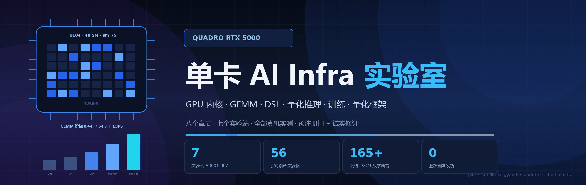
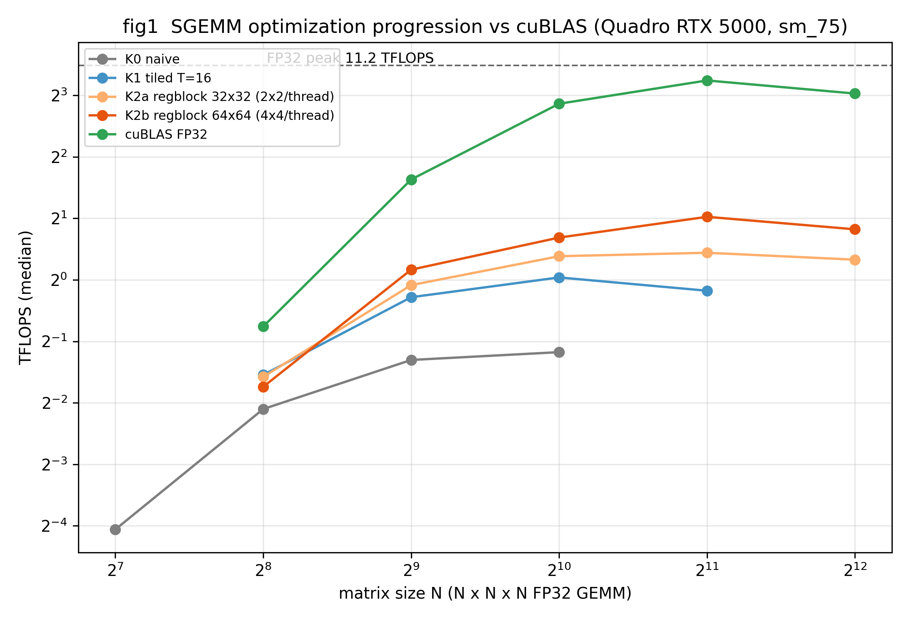
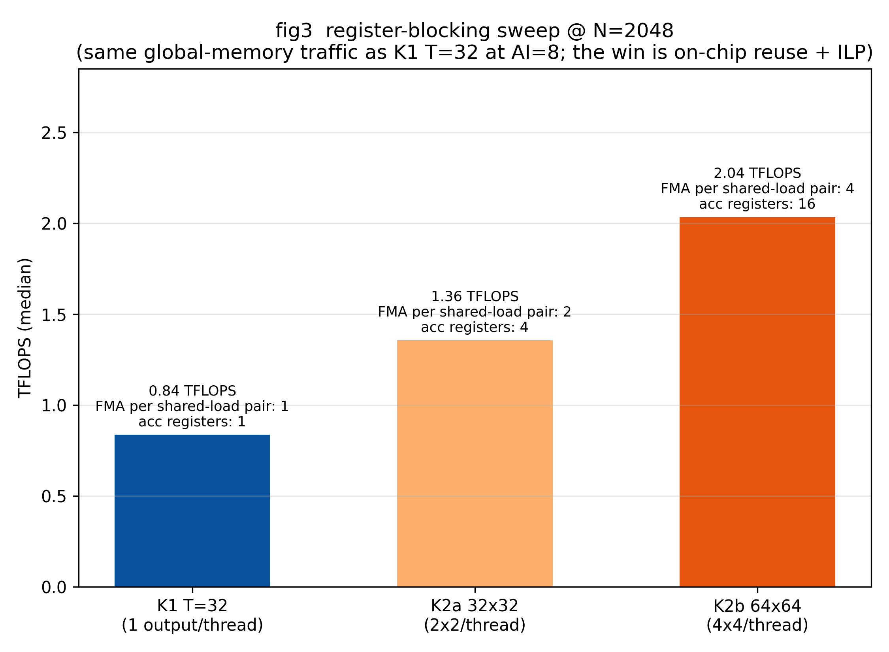
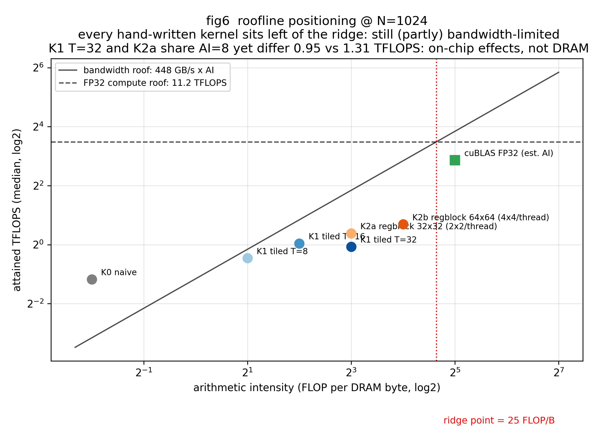
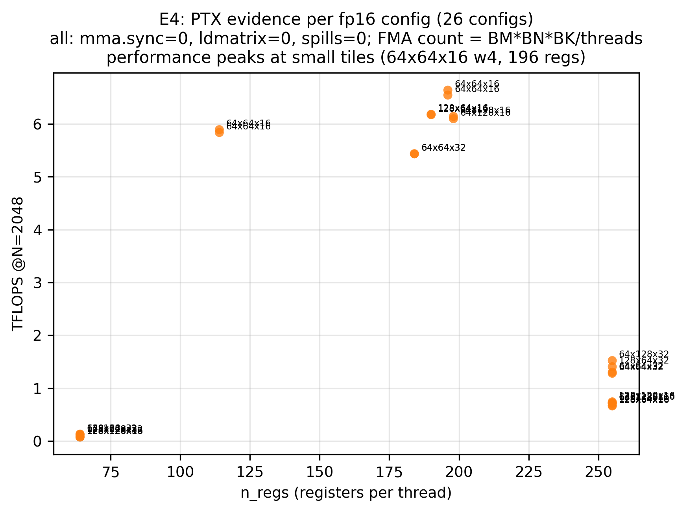
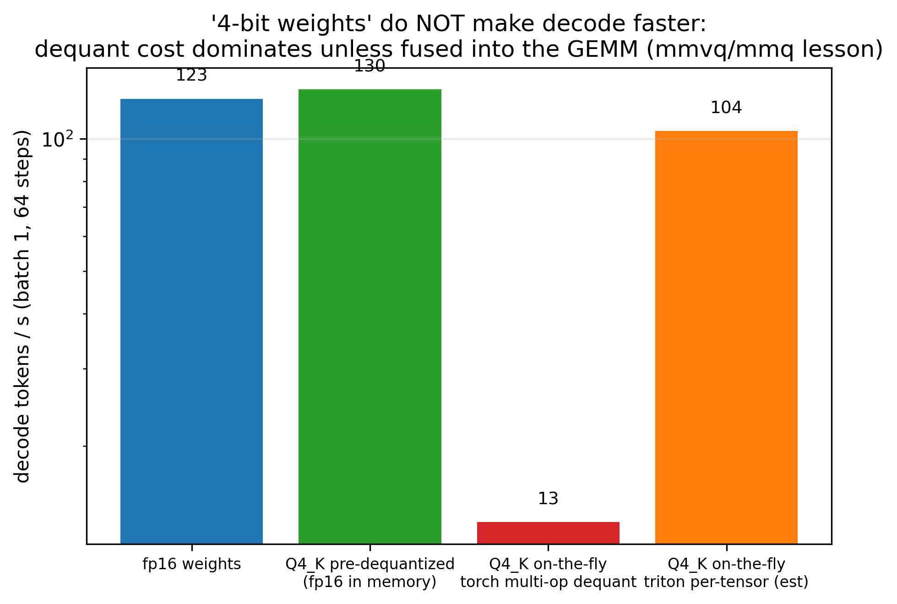
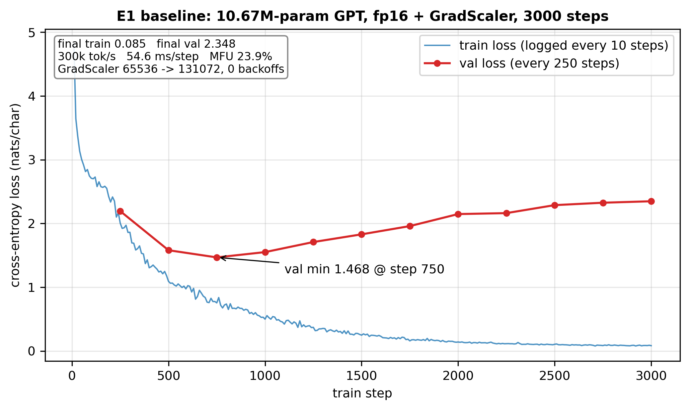
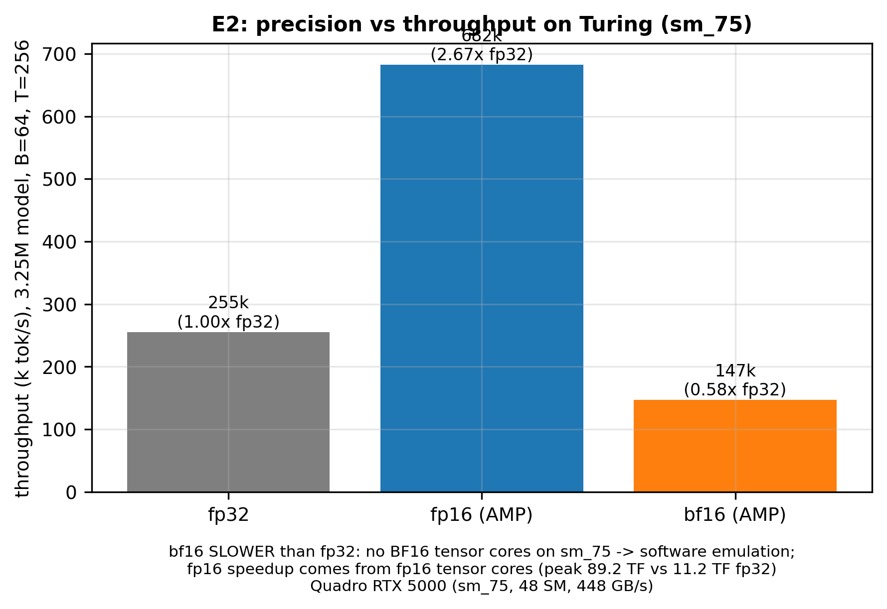
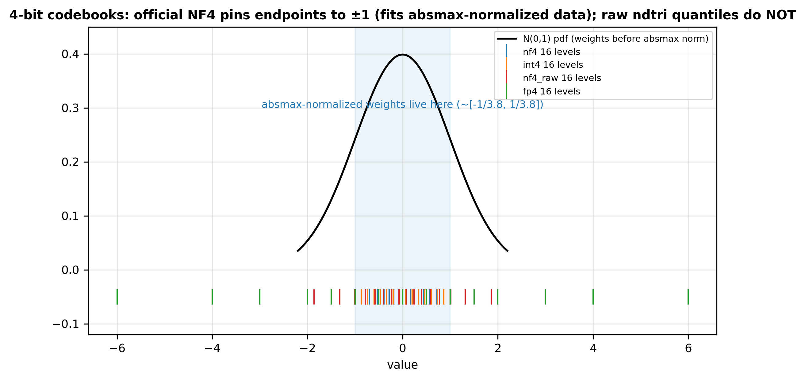
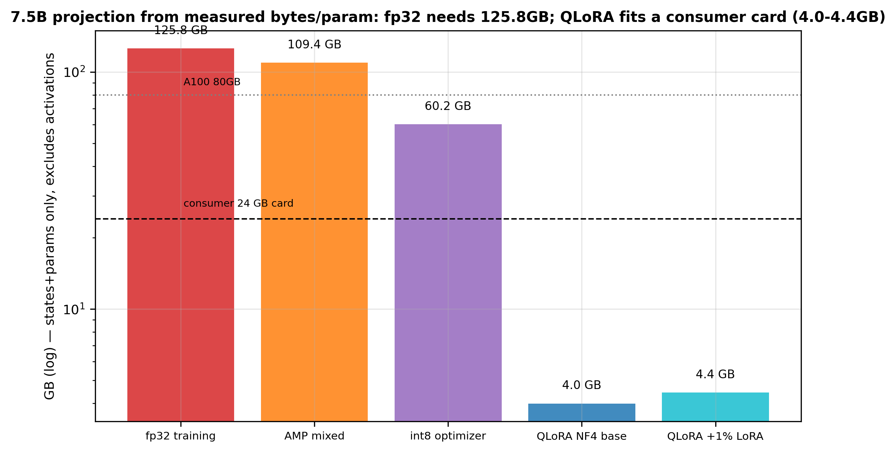

<p align="center">
  
</p>

<p align="center">
  <a href="https://gitee.com/liu-xingyan04/quadro-rtx-5000-ai-infra/releases"></a>
  
  
  
  
  
  
</p>

# 单卡 AI Infra 实验室

一台 **Quadro RTX 5000**（Turing sm_75，16 GB），七个实验站，把 AI Infra
面试要考的东西**全部真机做一遍**：从 GPU 编程手感、手写 GEMM、Triton DSL、
GGUF 量化推理、nanoGPT 训练，到 bitsandbytes / tinygrad 框架拆解与量化算法复刻。

每一站都遵循同一条纪律：**预注册门 + 诚实修订**——先写下预期数字，跑出来不达门
就如实记录原因；计时用多轮中位数 + 烧机拉频；文档里的每个数字都有 JSON 快照支撑，
并有自动断言脚本对账（合计 **165+ 项**）。

---

## 目录

- [实验站地图](#实验站地图)
- [亮点数字速查](#亮点数字速查)
- [图表精选](#图表精选)
- [方法论纪律](#方法论纪律)
- [仓库结构](#仓库结构)
- [快速复现](#快速复现)
- [上游快照与提交号](#上游快照与提交号)
- [讲义附件](#讲义附件)
- [工程流程：SDD 归档](#工程流程sdd-归档)
- [这台机器的边界](#这台机器的边界)
- [面试笔记索引](#面试笔记索引)

## 实验站地图

| 站 | 目录 | 一句话 | 标志性结果 |
|---|---|---|---|
| AR001 | [`01-foundations/`](01-foundations/) | GPU-Puzzles 14 题独立解答 + 双通道验证器 | CPU 线程仿真 / GPU 真编译**双通道全过**，自带负向自检 |
| AR002 | [`02-handwritten-kernels/gemm-lab/`](02-handwritten-kernels/gemm-lab/) | FP32 SGEMM 手写三级优化 vs cuBLAS | K0→K2 **3.6×**，cuBLAS 再 **4.65×**，FP16 TC 再 **5.8×** 三个断层 |
| AR003 | [`03-gemm/gemm-sweep/`](03-gemm/gemm-sweep/) | cuBLAS 形状×调度×dtype 八组扫描 + CUTLASS 拆解 | M,N≥512 中位 **9.71 TF**；FP32→FP16 **6.4-6.9×**；split-K 手工全败 |
| AR004 | [`04-kernel-dsl/triton-lab/`](04-kernel-dsl/triton-lab/) | Triton / cuBLAS / numba 三方同协议对照 | Triton FP32 = **87% cuBLAS**；fp16 26 config **全未触发 mma**（PTX 取证） |
| AR005 | [`05-inference/gguf-lab/`](05-inference/gguf-lab/) | 自训 char-LM → 自实现 Q8_0/Q4_K → GPU 量化推理全链路 | `ggml-quants.c` 逐行移植 **bit-exact**；triton fused dequant **264 GB/s** |
| AR006 | [`06-training/nanogpt-lab/`](06-training/nanogpt-lab/) | nanoGPT 零改动导入，精度/预算/扫描/profiler 七组实验 | fp16 = **2.67× fp32**；**bf16 反慢 0.57×**（sm_75 无 BF16 TC）；MFU 7.5→29.9% |
| AR007 | [`07-frameworks/frameworks-lab/`](07-frameworks/frameworks-lab/) | bnb/tinygrad 只读拆解 + NF4/LLM.int8/Adam8bit 纯 torch 复刻 | NF4 **0.092 < INT4 0.100**；τ=8 分解 **4.2× 回 int8 本底**；Adam8bit 状态显存 **0.254×**；7.5B QLoRA **4.0 GB** |

`08-kernel-research/` 放的是算子研究的题库与起点：
[KernelBench](08-kernel-research/KernelBench/)（记分板）与
[flash-attention-sm75](08-kernel-research/flash-attention-sm75/)（WMMA 前向，
"做到接近 SDPA 再补反向"是一条完整的算子研究线）。

## 亮点数字速查

全部为 Quadro RTX 5000 真机实测（[实测] = JSON 快照可溯源，[源码] = file:line 可定位）：

| 数字 | 值 | 出处 |
|---|---|---|
| cuBLAS FP32 @2048 | **9.47-10.46 TF**（跨观测带 84.5% 峰值） | AR002/AR003 |
| cuBLAS FP16 TC @2048 | **54.9-67.4 TF**（跨会话时钟态 ±10%） | AR002/AR003 |
| 手写 SGEMM 最好（寄存器分块 64×64） | **2.04 TF**（18.2% 峰值） | AR002 |
| Triton FP32 matmul @2048 | **8.67 TF** = cuBLAS 的 87% | AR004 |
| Triton fp16 dot 在 sm_75 | 26 config 全部 `mma.sync=0`（标量 FMA） | AR004 PTX 取证 |
| 访存型 kernel 带宽天花板 | **369-378 GB/s**（82-84% HBM） | AR004 |
| GGUF triton fused dequant | **264 GB/s** | AR005 |
| nanoGPT fp16 加速比 | **2.67×** fp32；bf16 反慢 **0.57×** | AR006 |
| eager 训练一步 GEMM 占比 | 仅 **27%**（transpose 245 次/步） | AR006 profiler |
| NF4 vs INT4（N(0,1)） | rel-RMSE **0.092 < 0.100** | AR007 |
| LLM.int8 离群分解 | τ=8（0.4% 列 fp16）误差 **4.86e-2 → 1.14e-2** | AR007 |
| int8 GEMM 吞吐 | default **0.59×** fp16 → TN 布局 **1.29×**（配对 1.83×） | AR007 诚实 FAIL + 修订 |
| 8-bit Adam 收敛 | 与 fp32 终值差 **0.0207**（< 训练噪声门 0.05） | AR007 |
| 优化器状态显存 | **0.254×** fp32 | AR007 |
| 显存账本 | **16.78 → 0.5315** B/param（fp32 训练 → NF4 存储） | AR007 |
| 7.5B 外推 | fp32 训练 **125.8 GB** → QLoRA **4.0 GB** | AR007 |

## 图表精选

全库 **56 张 300 DPI 实验图**均已入库，完整图集见各 lab `figs/` 目录；
每一张都能从 `results/*.json` 一条命令复原（`python plot_results.py`）。
下面按站精选 14 张，看完整实验叙事请进各 lab 的 `results.md`（逐图中文分析）。
AR001 为解答与双通道验证器，无图表。

### AR002 · 手写 GEMM 阶梯（[gemm-lab](02-handwritten-kernels/gemm-lab/)）

<p align="center"></p>

**fig1 · 优化阶梯 vs cuBLAS**：K0 撞带宽地板后饱和（0.443 TF @N=1024，N 翻倍时间也翻倍）；K1/K2 各自进入平台 1.03 / 2.04；cuBLAS FP32 在 N=2048 达 9.468 TF（84.5% 峰值）。三条手写曲线就是「每 FLOP 分摊的 DRAM 字节数」的三个档位。

<p align="center"></p>

**fig3 · 寄存器分块的机制**：K1_T32 → K2a → K2b（0.838 → 1.357 → 2.036 TF）的 DRAM 流量完全相同，差距全在片上——每 FMA 的 shared 读从 2 次降到 1/4，16 个独立累加器填满 FMA 流水线气泡。天花板是寄存器堆：TM×TN 再加到 8×8（64 累加器）就 spill 反崩。

<p align="center"></p>

**fig6 · Roofline 的经典盲区**：全部手写 kernel 的 AI≤16，都还在带宽侧；K0 的点落在带宽屋顶上方 4×——模型只算 DRAM 没算 4MB L2，naive kernel 靠 L2 挡掉了约 3/4 流量。主动指出这一点，比背 roofline 公式更值钱。

### AR003 · cuBLAS 形状 × 调度扫描（[gemm-sweep](03-gemm/gemm-sweep/)）

<p align="center"></p>

**fig1a · 49 格形状全实测热图**：M,N≥512 的内部区域 85-91% 峰值（中位 9.71 TF）；64³ 只有 0.54 TF——"太小"不等于"慢"，是 launch 主导；2048² 微凹 -11%，红色 wave 等值线与实测台阶对齐但不精确，这正是库启发式存在的证据。

<p align="center"></p>

**fig2 · skinny 的两平台结构**：M≤32 是纯带宽问题（360-386 GB/s = 80-86% HBM，GEMV 场景的正确指标是 GB/s 不是 TFLOPS）；M≥128 进入算力平台 9.7-10.2 TF；roofline 拐点 M*≈51 实测落在 M=32~64 之间——理论与实测在同一档采样内对上。

### AR004 · Triton 三方对照与 PTX 取证（[triton-lab](04-kernel-dsl/triton-lab/)）

<p align="center"></p>

**fig5 · 同题三方对照**：Triton + config 扫描 @2048 = 8.67 TF = cuBLAS 的 87%；同样的算法骨架手写成 numba 只有 20%——代码生成（软件流水、stages、shared 访问模式）值 4×。"会用 Triton"和"用 Triton 写到接近库"是两个台阶。

<p align="center"></p>

**fig9 · 「源码有 ≠ 二进制启用」的 PTX 取证**：26 个 fp16 config 全部 `mma.sync=0 / ldmatrix=0`（退化为标量 FMA，比自己的 fp32 还慢 16-23%），最优解全是小 tile（64×64×16 w4）；cuBLAS 走 Tensor Core 同题快 9.5×。上游源码有 Turing MMAv2 路径，但本机 3.8.0 wheel 未为 sm_75 触发——验证特性必须用 PTX 计数，不要信文档推断。

### AR005 · GGUF 量化推理全链路（[gguf-lab](05-inference/gguf-lab/)）

<p align="center"></p>

**fig3 · dequant 实现阶梯**（Q4_K）：naive Python 循环 9205 ms → torch 多算子向量化 2.2 ms（同规模 4182×，但全尺寸只有 19.3 GB/s = 4.3% HBM，launch-bound）→ triton 单 kernel flat 设计 0.290 ms（264 GB/s = 59% HBM，13.7×）。这就是 llama.cpp 把 dequant 融进 GEMM（mmvq/mmq）的根本原因：生产路径根本不物化 fp16 权重。

<p align="center"></p>

**fig9 · 「4-bit 提速」的真相**（batch=1 解码）：fp16 权重 123.3 t/s；Q4_K 预反量化 129.5 t/s（与 fp16 相当——省的是 3.54× 显存）；每步现反量化则慢到 13.4 t/s（torch 多算子，9.2×）或 104.1 t/s（triton per-tensor）。量化收益在存储侧，代价全在搬运侧。

### AR006 · nanoGPT 训练七组实验（[nanogpt-lab](06-training/nanogpt-lab/)）

<p align="center"></p>

**fig1 · fp16 基线**：3000 步 train 0.085；val 教科书 U 型——最优 1.468 @step 750，终值 2.348（854 KB 语料上 58 个 epoch，模型容量 vs 数据量的最直观形态）；300k tok/s、MFU 23.9%、GradScaler 0 次 backoff。

<p align="center"></p>

**fig3 · Turing 的现实**：fp16 = 2.67× fp32（Tensor Core）；bf16 反慢 0.57×——sm_75 没有 BF16 Tensor Core，走软件仿真。"新精度 ≠ 更快"的最直接实测。

<p align="center"></p>

**fig13 · eager 的时间去哪了**：GEMM 只占 27%（75 次 mm/步）；transpose 4900 次/20 步（3.6%）、cat/as_strided 等 eager 开销 9.1%。余下 73% 正是 llm.c 手写融合与 torch.compile 想吃掉的部分。

### AR007 · 量化框架拆解与复刻（[frameworks-lab](07-frameworks/frameworks-lab/)）

<p align="center"></p>

**fig_e1a · NF4 码本的设计逻辑**：官方表端点在 ±1，与裸 ndtri 分位点（±1.863）差一个端点变换——它是为「每块除 absmax」这个操作配套设计的码本；block=64 下 NF4 0.092 < INT4 0.100，在重尾 head 层（峰度 8.4）优势拉大到 23%。分布越尖，分位码本越赚。

<p align="center"></p>

**fig_e5b · 7.5B 显存外推**（由实测 bytes/param 外推）：fp32 训练 125.8 GB → AMP 109.4 → int8 优化器 60.2 → QLoRA NF4 底座 4.0 GB。全参训练需要 A100 级别，QLoRA 把门槛拉到消费卡——0.5315 B/param 的 NF4 packed 存储就是论文「65B on a single 48GB」的算术基础。

## 方法论纪律

七个站共用一套从 AR002 起打磨的纪律，这本身就是本仓库的核心产出之一：

1. **预注册门 + 诚实修订** — 每个关键结论先写下预期（如 "int8 ≥ 1.2× fp16"），
   不达门就完整记录归因与修订（AR007 G2：default 布局落 cuBLAS int8 慢路径 NT，
   TN 修订后 1.29×，四布局归因实测支撑）。verify 脚本里内置
   "恰好一 FAIL 门" 断言防止无脑全绿。
2. **计时纪律** — CUDA Event，3 遍 × 5 样本中位数；每遍前 ~1s 持续发射 warmup
   （显示 GPU 闲时降频，2 次发射拉不回 boost 时钟）；pinned memory H2D；
   复现性 <4%。跨会话时钟态噪声（FP16 TC ±10%）单独标定口径。
3. **JSON 单一真值源** — 全部图从 `results/*.json` 取数；`verify_numbers.py`
   把 results.md / notes 里的数字与 JSON 逐项断言（AR006 84 项 + AR007 81 项）。
4. **上游零改动** — bnb / tinygrad / nanoGPT / llama.cpp / CUTLASS 等克隆只读
   （mtime 核查 0 修改），复刻算法全部写在独立 `*_lab` / `quant_ops.py` 里，
   与官方码本逐值对齐。
5. **[实测] / [源码] 分级** — 笔记里每个结论标注来源：真机实测还是 file:line
   源码拆解，不编造未运行验证的运行时行为。

## 仓库结构

```
├── docs/cover.png              # 封面（make_cover.py 可重生成；全尺寸 cover_hires.png 同步入库）
├── specs/archive/              # AR001-007 需求/设计/ST 用例归档（SDD 流程）
├── 01-foundations/             # GPU-Puzzles 解答 + GPU MODE 讲义笔记
├── 02-handwritten-kernels/
│   ├── gemm-lab/               # AR002：手写 SGEMM 三级 + cuBLAS 对照
│   └── LeetCUDA/               # 上游快照（200+ kernel 题库）
├── 03-gemm/
│   ├── gemm-sweep/             # AR003：cuBLAS 八组扫描 + CUTLASS 拆解
│   └── cutlass/                # 上游快照
├── 04-kernel-dsl/
│   ├── triton-lab/             # AR004：Triton 三方对照 + PTX 取证
│   ├── triton/  tvm/           # 上游快照
├── 05-inference/
│   ├── gguf-lab/               # AR005：GGUF 量化复刻 + GPU 推理全链路
│   └── llama.cpp/  exllamav2/  # 上游快照
├── 06-training/
│   ├── nanogpt-lab/            # AR006：nanoGPT 训练七组实验
│   └── nanoGPT/  llm.c/        # 上游快照
├── 07-frameworks/
│   ├── frameworks-lab/         # AR007：bnb/tinygrad 拆解 + 量化算法复刻
│   └── bitsandbytes/  tinygrad/# 上游快照
└── 08-kernel-research/         # KernelBench + flash-attention-sm75
```

每个 lab 目录内：`README.md`（复现步骤）、`results.md`（逐图中文分析）、
`results/*.json`（原始数据）、`figs/`（实验图，已入库）、`verify_numbers.py`（文档-JSON 断言）。

> **实验产物与再生成**：`figs/`（56 张 300 DPI 图）、`data/`（语料与 token）、
> `*.pt` / `*.gguf`（训练 checkpoint 与导出模型）均随仓库分发，克隆即得完整
> 结果；README [图表精选](#图表精选) 直接引用入库图。其中 3 个 >17MB 的大文件
> （`e1_checkpoint.pt` / AR007 `corpus.txt` / `tokens.npy`）以 `.partNNNN`
> 分片形式入库（受上传通道单次 ≤76KB 限制），运行
> `python tools/reassemble_artifacts.py` 一键重组并 SHA256 校验。同批产物
> 也可由 `plot_results.py` / `corpus_prep.py` / `charlm.py` 一键复原，
> 与 `results/*.json` 原始数据互相印证。

## 快速复现

环境：Windows + Quadro RTX 5000（驱动 556.18 / CUDA 12.5）+ 全局 Python 3.11
（torch 2.5.1+cu121 + triton 3.8 + matplotlib）。仅 AR001/AR002 的 numba CUDA
路线需要专用 venv（`numba-cuda` 工具链 pin 到 12.5.x，见
[01-foundations/GPU-Puzzles/solutions/README.md](01-foundations/GPU-Puzzles/solutions/README.md)）。

```powershell
# AR002 手写 GEMM（~7 分钟）
cd 02-handwritten-kernels/gemm-lab; python bench_torch.py; python plot_results.py

# AR003 cuBLAS 扫描（~3 分钟）
cd 03-gemm/gemm-sweep; python bench_sweep.py --exp all; python plot_results.py

# AR004 Triton 三方对照（~4 分钟）
cd 04-kernel-dsl/triton-lab; python bench_dsl.py --exp E1; python bench_dsl.py --exp E3; python plot_results.py

# AR005 GGUF 量化推理全链路（~15 分钟）
cd 05-inference/gguf-lab; python charlm.py; python bench_infer.py all; python plot_results.py

# AR006 nanoGPT 训练（~15 分钟）
cd 06-training/nanogpt-lab; python corpus_prep.py; python gpt_lab.py all; python plot_results.py; python verify_numbers.py

# AR007 框架与量化（~10 分钟）
cd 07-frameworks/frameworks-lab; python corpus_prep.py; python framework_lab.py all; python plot_results.py; python verify_numbers.py

# 封面（~2 秒）
cd docs; python make_cover.py
```

## 上游快照与提交号

以下目录为 2026-10-05 从 GitHub 浅克隆的只读快照（`--depth 1`，未拉取子模块），
零改动，仅作源码拆解与对照的底座；各自遵循上游 LICENSE：

| 目录 | 上游 | 提交 |
|---|---|---|
| `01-foundations/GPU-Puzzles` | [srush/GPU-Puzzles](https://github.com/srush/GPU-Puzzles) | `b3c4b23` |
| `01-foundations/gpu-mode-lectures` | [gpu-mode/lectures](https://github.com/gpu-mode/lectures) | `77a8df4` |
| `02-handwritten-kernels/LeetCUDA` | [xlite-dev/LeetCUDA](https://github.com/xlite-dev/LeetCUDA) | `c5e985f` |
| `02-handwritten-kernels/how-to-optim-algorithm-in-cuda` | [BBuf/how-to-optim-algorithm-in-cuda](https://github.com/BBuf/how-to-optim-algorithm-in-cuda) | `5c85a89` |
| `03-gemm/cutlass` | [NVIDIA/cutlass](https://github.com/NVIDIA/cutlass) | `0b55a2f` |
| `04-kernel-dsl/triton` | [triton-lang/triton](https://github.com/triton-lang/triton) | `fa8415b` |
| `04-kernel-dsl/tvm` | [apache/tvm](https://github.com/apache/tvm) | `a771de8` |
| `05-inference/llama.cpp` | [ggml-org/llama.cpp](https://github.com/ggml-org/llama.cpp) | `d89651a` |
| `05-inference/exllamav2` | [turboderp-org/exllamav2](https://github.com/turboderp-org/exllamav2) | `7dc12af` |
| `06-training/nanoGPT` | [karpathy/nanoGPT](https://github.com/karpathy/nanoGPT) | `3adf61e` |
| `06-training/llm.c` | [karpathy/llm.c](https://github.com/karpathy/llm.c) | `f1e2ace` |
| `07-frameworks/tinygrad` | [tinygrad/tinygrad](https://github.com/tinygrad/tinygrad) | `246ca9a` |
| `07-frameworks/bitsandbytes` | [bitsandbytes-foundation/bitsandbytes](https://github.com/bitsandbytes-foundation/bitsandbytes) | `8336490` |
| `08-kernel-research/KernelBench` | [ScalingIntelligence/KernelBench](https://github.com/ScalingIntelligence/KernelBench) | `423217d` |
| `08-kernel-research/flash-attention-sm75` | [JohnScheuer/flash-attention-sm75](https://github.com/JohnScheuer/flash-attention-sm75) | `e2d4fb2` |

> `how-to-optim-algorithm-in-cuda` 有 11 个文件名含冒号，Windows 检出时已按
> `WINDOWS-CHECKOUT.txt` 的对应关系写成冒号替换为 ` -` 的副本。

## 讲义附件

各上游仓库随附的 PDF/PPTX 讲义合计约 570 MB，因 Gitee 单仓库体积上限不入库，
打包放在本仓库的 **Release 附件**（`slides-01.zip` ~ `slides-07.zip`，tag
`slides-2026-10-05`）。解压到仓库根目录后相对路径还原，笔记中的幻灯片链接
重新对上。清单见 [SLIDES-MANIFEST.txt](SLIDES-MANIFEST.txt)。

## 工程流程：SDD 归档

七个实验站不是随手写的脚本堆，每一站都走了完整的需求-设计-开发-审查-验收
流程，产物归档在 [`specs/archive/`](specs/archive/)：

```
specs/archive/AR001-gpu-puzzles-solutions/   srs.md + design.md + st-cases.md
specs/archive/AR002-gemm-lab/                （同上，ST 用例 + 执行报告）
specs/archive/AR003-cublas-gemm-sweep/
specs/archive/AR004-triton-dsl-lab/
specs/archive/AR005-llamacpp-inference-lab/
specs/archive/AR006-nanogpt-training-lab/
specs/archive/AR007-quant-frameworks-lab/
```

`srs.md` 里的每条验收标准（Given/When/Then）都能在 `st-cases.md` 中找到
对应的 ST 用例与实际执行结果（AR007：12/12 PASS，需求覆盖 100%）。

## 这台机器的边界

| 部件 | 规格 | 对实验设计的影响 |
|---|---|---|
| CPU | Xeon Gold 6234，8C16T @3.3 GHz | 数据预处理够用；数据加载先进内存 |
| 内存 | 128 GB | 语料/tokenizer 缓存常驻 |
| GPU | Quadro RTX 5000（TU104，sm_75） | 48 SM / 3072 CUDA Core / 384 第二代 Tensor Core |
| 显存 | 16 GB GDDR6，448 GB/s | 工作集以 16 GB 为准 |
| 算力 | FP32 ~11.2 TF；FP16 TC ~89.2 TF | FP32 拐点 ~25 FLOP/byte，FP16 TC ~199 FLOP/byte |
| 片上 | shared 64 KB/SM，L2 4 MB | kernel 按 64 KB 分块，不按 Hopper 228 KB 写 |
| 互联 | PCIe 3.0（~12 GB/s H2D） | 大权重分层换入显存，decode 被总线卡住 |

Turing Tensor Core 只做 FP16/INT8/INT4；BF16/FP8/TMA/WGMMA 是 Ampere 之后的
硬件——这正是 AR006 "bf16 反慢 0.57×" 与 AR004 "Triton fp16 未触发 mma"
两组反直觉实测的根源，也是本仓库反复出现的主题：**硬件边界决定软件行为**。

16 GB 上现实的模型尺度：从头训练 GPT-2 small/medium 一档；微调 7B 走
bitsandbytes 4-bit QLoRA（AR007 账本：7.5B QLoRA 4.0 GB）；推理 7B FP16
或 13B 4-bit。

## 面试笔记索引

每站配六段结构面试笔记（高频问法 / 追问链 / 数字卡片 / 手写骨架 / 红线清单 /
60 秒电梯陈述），全部数字 [本机实测] 或 [源码 file:line]：

- [INTERVIEW-INDEX.md](01-foundations/notes/INTERVIEW-INDEX.md) — 跨站主题索引（七站数字总卡片）
- AR001-AR004 讲义笔记：[01-foundations/notes/](01-foundations/notes/)
- [AR002 gemm-lab-notes](02-handwritten-kernels/notes/gemm-lab-notes.md) ·
  [AR003 gemm-sweep-notes](03-gemm/notes/gemm-sweep-notes.md) ·
  [AR03 CUTLASS 拆解](03-gemm/notes/cutlass-turing-dissection.md)
- [AR04 triton-notes](04-kernel-dsl/notes/triton-notes.md) ·
  [tl.dot lowering 取证](04-kernel-dsl/notes/triton-lowering-sm75.md)
- [AR05 llamacpp-notes](05-inference/notes/llamacpp-notes.md) ·
  [llama.cpp 内部件拆解](05-inference/notes/llamacpp-internals.md)
- [AR06 nanogpt-training-notes](06-training/notes/nanogpt-training-notes.md) ·
  [llm.c 内部件拆解](06-training/notes/llmc-internals.md)
- [AR07 frameworks-notes（六段）](07-frameworks/frameworks-lab/notes/frameworks-notes.md) ·
  [bnb 内部件拆解](07-frameworks/frameworks-lab/notes/bnb-internals.md) ·
  [tinygrad 内部件拆解](07-frameworks/frameworks-lab/notes/tinygrad-internals.md)

---

<p align="center">
  自研实验代码（<code>*-lab/</code>、<code>specs/</code>、<code>docs/</code>）仅供学习参考；<br>
  上游克隆目录版权归各自作者所有，遵循其原 LICENSE。
</p>
