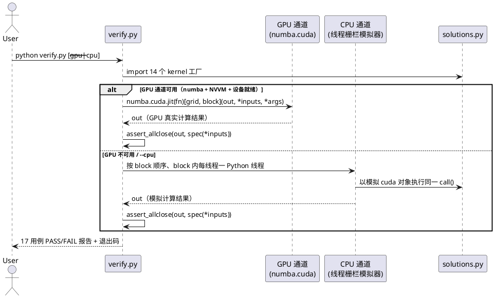
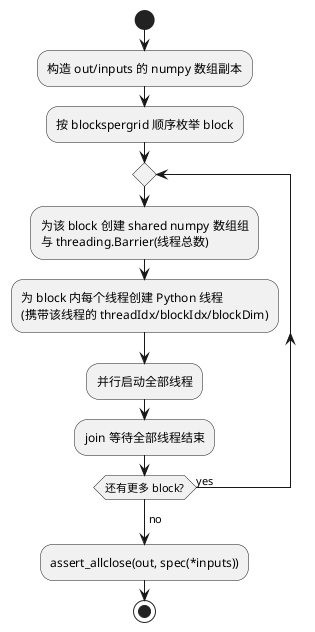
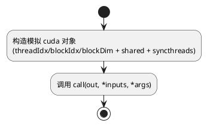

# 1 AR概述

| 组件名称 | 01-foundations 学习任务（GPU-Puzzles 解答 + GPU MODE 讲义笔记） |
| --- | --- |
| AR系统流水号 | AR001 |
| AR描述 | 完成 GPU-Puzzles 全部 14 道 Numba CUDA kernel 的独立解答文件；提供 GPU 真机（Quadro RTX 5000, sm_75）与 CPU 模拟双通道对拍验证脚本；产出 lecture_001~004/012/014 六讲详细逐节笔记。上游文件零改动，全局 Python 环境零改动。 |

# 2 动态行为

## 交互时序图



# 3 功能点分解

| 序号 | 功能点名称 | 功能点描述 |
| --- | --- | --- |
| 1 | 14 道 kernel 解答（srs §3.1） | solutions.py 中提供与上游同签名的 14 个 kernel 工厂函数，`# FILL ME IN` 逻辑完整 |
| 2 | GPU 真机对拍通道（srs §3.2-a） | 复刻 lib.py `run_cuda` 调用方式，在 sm_75 上真实编译运行，17 用例对拍 numpy spec |
| 3 | CPU 模拟对拍通道（srs §3.2-b） | 真线程 + Barrier 栅栏模拟器，`--cpu` 触发或 GPU 不可用时自动回退 |
| 4 | 六讲逐节笔记（srs §3.3） | lecture_001~004/012/014 详细笔记，含 sm_75 适配点与 puzzles 题号关联 |

# 4 实现设计

## 4.1 功能实现思路

**总原则：解答与验证分离、上游零改动、环境隔离。**

1. **solutions.py 是唯一解答源**：14 个 kernel 以 `def xxx_test(cuda): def call(out, a, ...): ...` 工厂形式给出，与上游 GPU_puzzlers.py 逐题同签名；常量（TPB、MAX_CONV 等）在文件顶部独立定义，不 import 上游（上游文件头部含 `!pip`/`!wget` 语句，不可直接导入）。
2. **verify.py 是唯一验证入口**：自带 17 个用例定义（题目数据 + spec 函数从上游逐字复刻；初稿误计 18，实为 10 单例 + Conv×2 + Sum×2 + AxisSum×1 + Matmul×2 = 17），双通道执行，统一报告。
3. **GPU 通道**：在 `solutions/.venv` 中装配 `numpy(<2.2) + numba + numba-cuda + nvidia-cuda-nvcc-cu12`（NVVM）；执行方式与 `lib.py::CudaProblem.run_cuda` 完全一致：`numba.cuda.jit(fn(numba.cuda))[blockspergrid, threadsperblock](out, *inputs, *args)`。不依赖 chalk/colour/IPython。
4. **CPU 通道（核心设计）**：`syncthreads` 的栅栏语义是难点。模拟器将 block 内每个 CUDA 线程映射为一个 Python 线程；`cuda.shared.array(...)` 返回该 block 所有线程共享的 numpy 数组（零初始化）；`cuda.syncthreads()` 调用 `threading.Barrier(块内线程总数).wait()`。CPython 的 GIL 与 Barrier 内部条件变量保证栅栏两侧的共享内存写读可见性，语义与 CUDA 硬件栅栏一致。block 之间顺序执行（block 间无共享状态，仅写 `out` 的不相交位置，顺序执行不影响正确性）。
5. **解答的栅栏纪律**：所有 kernel 中 `cuda.syncthreads()` 一律置于条件分支之外（全部线程统一到达），同时 shared 数组所有元素显式初始化（GPU 上 `cuda.shared.array` 未初始化，不能依赖零值）——这同时是 GPU 通道正确性与 CPU 模拟可行性的共同前提。

## 4.2 功能实现设计

### 4.2.1 流程图

CPU 模拟器单次用例执行流程：



单个线程内执行：



### 4.2.2 流程说明

1. verify.py 按用例表逐条执行；每条用例先在 CPU 通道或 GPU 通道运行 kernel 得到 `out`，再与 `spec(*inputs)` 对拍。
2. CPU 通道中，`cuda` 模拟对象的 `threadIdx`/`blockIdx`/`blockDim` 为带 `.x`/`.y` 属性的轻量命名结构；`shared.array(shape, dtype)` 忽略 dtype 细节（统一 float32/float64 由 numpy 承载），返回 block 级共享数组；`syncthreads()` = `Barrier.wait()`。
3. GPU 通道中，`fn(numba.cuda)` 传入真实 numba.cuda 模块，`cuda.shared.array`/`cuda.syncthreads`/`cuda.threadIdx` 等为 numba 原生语义，`numba.cuda.jit` 完成真实编译（RTX 5000 → sm_75）与执行。
4. 任一用例失败：打印该题 Yours/Spec 对照，记入失败清单，最终退出码 1。

## 4.3 接口描述

**无对外服务接口。** 本 AR 为本地学习任务交付物，接口均为 Python 模块级约定：

| 接口 | 签名 | 说明 |
| --- | --- | --- |
| kernel 工厂 | `def <name>_test(cuda) -> Callable[[np.ndarray, ...], None]` | 与上游同名函数一致；返回 `call(out, *inputs, *args)`，内部用 `cuda.threadIdx/blockIdx/blockDim/shared/syncthreads` |
| 验证入口 | `python verify.py [--gpu\|--cpu]` | 缺省自动：先试 GPU，失败回退 CPU；`--cpu` 强制 CPU |
| 用例定义 | `CASES: list[Case]`（verify.py 内） | `Case(name, fn, inputs, out, args, bpg: Coord, tpb: Coord, spec)`，Coord 复刻上游 `(x, y)` 语义 |

## 4.4 代码设计

### 目录结构

```
01-foundations/
├── GPU-Puzzles/                  ← 上游，零改动
│   └── solutions/                ← 新增交付目录
│       ├── solutions.py          ← 14 个 kernel（唯一解答源）
│       ├── verify.py             ← 17 用例 + 双通道验证（唯一验证入口）
│       ├── .venv/                ← 独立虚拟环境（numba + NVVM；不提交/不影响全局）
│       └── README.md             ← 使用说明（venv 重建步骤）
└── notes/                        ← 新增笔记目录
    ├── lecture_001-notes.md ... lecture_004-notes.md
    ├── lecture_012-notes.md
    └── lecture_014-notes.md
```

### 各 kernel 算法设计（F1 核心）

| # | 题目 | 算法要点 | 边界/异常处理 |
| --- | --- | --- | --- |
| 1 | Map | `out[local_i] = a[local_i] + 10` | 无（线程数=数据量） |
| 2 | Zip | `out[local_i] = a[local_i] + b[local_i]` | 无 |
| 3 | Guards | `if local_i < size:` 才读写 | 越界线程直接跳过 |
| 4 | Map 2D | 二维线程索引，`if` 双向 guard | 线程 3×3 > 数据 2×2 |
| 5 | Broadcast | `a[local_i, 0] + b[0, local_j]` | 同上双向 guard |
| 6 | Blocks | 全局索引 `blockIdx.x*blockDim.x+threadIdx.x` + guard | 9 数据 / 4 线程×3 block |
| 7 | Blocks 2D | x、y 两个方向独立全局索引 + 双向 guard | 5×5 数据 / 3×3 线程×2×2 block |
| 8 | Shared | scaffold 已写 `shared[local_i]=a[i]`+sync；补 `out[i]=shared[local_i]+10` | guard 内已含 sync（本题所有线程均满足 i<size） |
| 9 | Pooling | 全员写 shared + sync；`acc = shared[i]`，`local_i>=1` 加 `shared[i-1]`，`local_i>=2` 加 `shared[i-2]` | 窗口越界用 if 抑制；每线程 1 读 1 写 |
| 10 | Dot | 全员写 `shared[local_i]=a[i]*b[i]` + sync；树状归约（stride 4→2→1，每步 sync）；线程 0 写 `out[0]` | shared 全员显式初始化 |
| 11 | 1D Conv | shared 容量 `TPB+MAX_CONV=12`；每线程载 `shared[local_i]=a[i]`，`local_i<MAX_CONV` 者补载 halo `shared[TPB+local_i]=a[i+TPB]`（有界）；sync；`acc=Σ shared[local_i+j]*b[j]`（`i+j<a_size` 才累加） | 两测试：6/3（1 block）与 15/4（2 block）；halo 载入条件与累加条件一致，未载入位置恰好不被消费 |
| 12 | Prefix Sum | 全员 `cache[local_i]=a[i]`（越界补 0）+ sync；减半树归约：`skip=TPB//2; while skip>0: 若 local_i<skip 则 cache[local_i]+=cache[local_i+skip]; sync; skip//=2`；`local_i==0` 写 `out[blockIdx.x]=cache[0]`（与 srs「每步合并剩余一半」一致；初稿误写为 Hillis-Steele 倍增扫描形态，review 第 1 轮已修正） | 循环步数对所有线程一致（uniform），sync 安全；SIZE=15/TPB=8 时 block1 越界补 0 |
| 13 | Axis Sum | `batch=blockIdx.y`；全员 `cache[local_i]=a[batch, local_i]`（越界补 0）+ sync；树状归约（同 #10）+ sync；`local_i==0` 写 `out[batch,0]` | 列 6 < TPB 8，越界补 0 |
| 14 | Matmul | 每 block 算 out 的 TPB×TPB 子块；`for k0 in range(0, size, TPB)`：全员载 `a_shared[li,lj]=a[i, k0+lj]`、`b_shared[li,lj]=b[k0+li, j]`（越界补 0），sync，`acc += Σ_l a_shared[li,l]*b_shared[l,lj]`，sync；循环后 guard 内写 `out[i,j]=acc` | size=8/TPB=3 → 3 轮 × 2 读 = 6 全局读（题目要求达成）；size=2 用例靠补 0 与 guard 退化正确 |

**shared 初始化纪律（全题通用）**：GPU 上 `cuda.shared.array` 内容未定义；所有 kernel 对 shared 的每个元素先显式赋值（含越界补 0），之后才 sync 并读取。

### 错误处理设计

| 场景 | 处理 |
| --- | --- |
| venv 未创建 / numba 导入失败 / 无 CUDA 设备 | verify.py 打印诊断（缺什么、怎么装），自动切 CPU 通道；`--gpu` 显式指定时则报错退出（不静默降级） |
| kernel 写错（如去掉 guard） | 对应用例 FAIL，打印 Yours/Spec，退出码 1 |
| CPU 通道 Barrier 死锁（kernel 中 sync 放在了非 uniform 分支） | join 设超时，超时判定用例 FAIL 并提示「syncthreads 必须所有线程统一到达」 |
| 上游文件被误改 | T014 验收用文件清单+大小抽查核查（无 git 基线） |

### venv 装配设计（T001）

```
python -m venv .venv
.venv pip install "numpy<2.2" numba numba-cuda nvidia-cuda-nvcc-cu12
# 验证：.venv python -c "numba.cuda 检测 + 最简 add kernel 编译运行"
# 若镜像缺 nvidia wheel 或 NVVM 探测失败 → 记录原因，GPU 通道标记不可用，CPU 通道兜底（不阻塞 AR）
```

# 5 重构设计

无。本 AR 不修改任何既有代码。

# 6 测试设计

## 6.1 单元测试（UT）

17 个用例即 UT（上游逐字复刻的数据与 spec）：

| 用例 | 覆盖 |
| --- | --- |
| Map / Zip / Guard / Map 2D / Broadcast / Blocks / Blocks 2D / Shared / Pooling / Dot | 各 1 例，Puzzle 1~10 |
| 1D Conv (Simple) / 1D Conv (Full) | Puzzle 11：单 block 无 halo / 双 block 带 halo |
| Sum (Simple) / Sum (Full) | Puzzle 12：整除 / 非整除（block1 只有 7 个有效元素） |
| Axis Sum | Puzzle 13：batch 维 + 列归约 |
| Matmul (Simple) / Matmul (Full) | Puzzle 14：单块退化 / 多块迭代 6 读 |

双通道均须全绿：`verify.py --gpu`（真实 sm_75 编译执行）与 `verify.py --cpu`（栅栏模拟）。

## 6.2 接口测试

- `python verify.py` 无参数：自动通道选择正常，输出报告与退出码符合约定（0=全过，1=有失败）
- `python verify.py --cpu`：强制 CPU，不触碰 numba
- `python verify.py --gpu`（GPU 不可用时）：明确报错退出码非 0，不静默降级

## 6.3 业务场景测试

- 全量场景：双通道各完整跑一遍 17 用例（T009）
- 笔记验收：6 篇逐节笔记对照讲义目录核查覆盖性（T014）

## 6.4 异常场景测试

- **负向用例**：临时注入错误 kernel（去掉 Guard 的边界判断 / 归约前去掉 syncthreads 语义）→ verify 必须报 FAIL（CPU 通道下「去掉 sync」表现为 Barrier 未对齐或结果错误，二者之一必命中）
- **环境异常**：删除/重命名 .venv 后运行 → 诊断信息清晰并回退 CPU
- **栅栏纪律**：构造 sync 放入非 uniform 分支的 kernel → join 超时机制触发 FAIL，不挂死
- **上游完整性**：验收阶段核查上游两目录零改动
