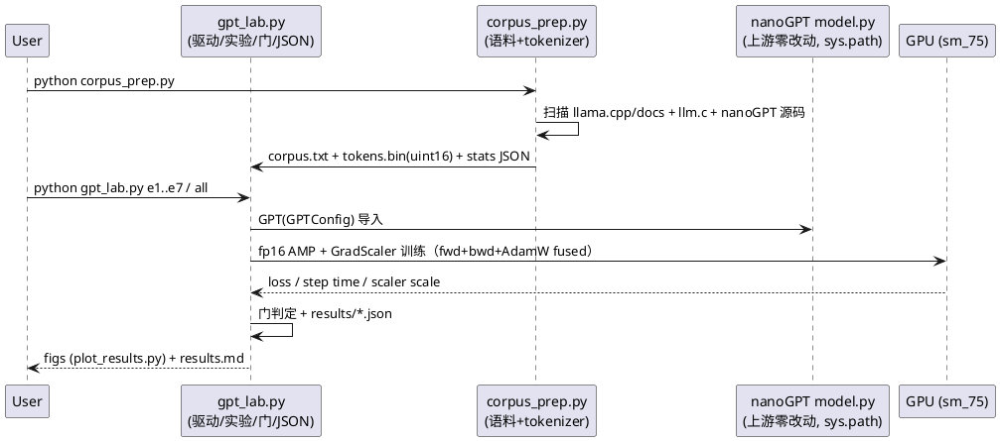
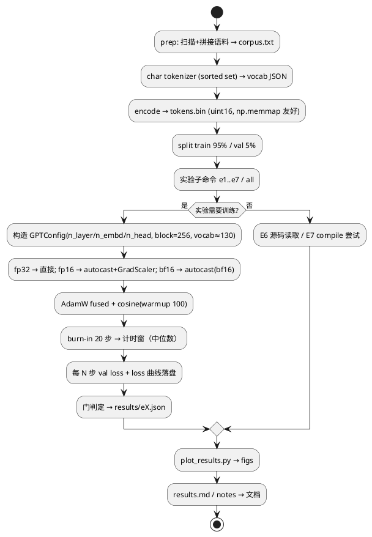

# 1 AR概述

| 组件名称 | nanogpt-training-lab（06-training 学习实验室） |
| --- | --- |
| AR系统流水号 | AR006 |
| AR描述 | 用 nanoGPT 的 GPT 实现真跑大尺度预训练（本地 780KB docs+code 语料，char-level），四条实验线（精度/规模/超参/吞吐归因）+ llm.c 训练 kernel 源码拆解，全链面向面试。 |

# 2 动态行为



# 3 功能点分解

| 序号 | 功能点名称 | 功能点描述 |
| --- | --- | --- |
| 1 | 语料构建 | 本地文本聚合 + char tokenizer + stats JSON |
| 2 | 训练驱动 | AMP 三精度/GradScaler/cosine/val/checkpoint/计时/JSON |
| 3 | E1 基线 | 6L-384 fp16 AMP ≥3000 步 + 生成样例 + 确定性 |
| 4 | E2 精度对比 | fp32 vs fp16 AMP vs bf16 AMP（Turing 无 TF32/bf16 TC） |
| 5 | E3 规模 scaling | 4 个规模固定 token 预算，loss/tokens/s/VRAM 三曲线 + 6N 对账 |
| 6 | E4 超参 | LR×schedule 扫描 + batch 扫描，发散如实记录 |
| 7 | E5 归因 | torch.profiler kernel 级 top-op + MFU roofline |
| 8 | E6 源码拆解 | llm.c fused classifier/adamw/layernorm/mfu（行号级） |
| 9 | E7 现状记录 | torch.compile 尝试 + SDPA backend 判定 |
| 10 | 图表/文档 | ≥10 图 + results.md + F4/F5 笔记 + README |

# 4 实现设计

## 4.1 功能实现思路

- **上游零改动复用**（沿用 AR005 gguf-py 模式）：`sys.path.insert` 指向
  `06-training/nanoGPT`，`from model import GPT, GPTConfig`。训练驱动、
  数据、实验全部自研在 `06-training/nanogpt-lab/`。
- **方案取舍**：（A）自研驱动+导入上游模型【选定】；（B）改 nanoGPT
  train.py【否——违反零改动】；（C）只读不跑【否——用户要求深度用 GPU】。
- **本机精度现实驱动设计**：Turing sm_75 无 TF32/bf16 TC → fp16 AMP+
  GradScaler 是唯一快速路径，E2 以此为中心叙事（scaler scale 轨迹是
  可观测教学数据）。
- **MFU 自算**：`flops_per_token = 6N + 12*L*H*Q*T`（PaLM/nanoGPT 同式），
  峰值分精度取 fp16→89.2 TF、fp32→11.2 TF（不用上游 estimate_mfu 的
  A100 312 TF 硬编码）。
- **计时纪律**（沿用 AR002-005）：前 20 步 burn-in 不计，之后每步
  `torch.cuda.synchronize` + perf_counter；tokens/s 用**中位数步时**折算；
  WDDM 噪声主要影响小 kernel，训练步本身是 ms 级、中位数稳健。

## 4.2 功能实现设计

### 4.2.1 流程图



### 4.2.2 流程说明

- **数据管道**：`corpus_prep.py` 聚合 `{llama.cpp/docs/*.md, llm.c/doc/**,
  llm.c/llmc/*.{cuh,cu,h}, llm.c/*.{c,cu,h}, nanoGPT/*.py, nanoGPT/README.md}`
  → 记录每个来源的字符数（语料构成落 JSON，可做「语料构成」标注）→
  char vocab（预期 ~120-140）→ uint16 bin。**docs+code 混合语料**是
  特色：生成样例能展示「模型学会了代码结构」。
- **训练驱动 `train_one(cfg, precision, steps, ...)`**：
  - precision ∈ {fp32, fp16(amp+GradScaler), bf16(amp)}；fp16 记录
    `scaler.get_scale()` 每步轨迹（含回退事件计数）
  - cosine + 100 步 linear warmup（与 nanoGPT train.py 同型）
  - fused AdamW（`configure_optimizers` 原生支持，打印 fused 与否）
  - val loss 每 250 步；loss 曲线每 10 步采样落 JSON
  - checkpoint 保存（E1 基线专用）
- **E3 固定 token 预算**：25M tokens/规模（B=64×T=256=16,384 tok/步 ≈
  1526 步）；四规模 {2L-128, 4L-256, 6L-384, 8L-512}≈{0.5M,3M,10.5M,25M}。
  预计 25M 模型 ~2.5 TF/步 @ ~20 TF ≈ 125ms/步 → E3 总计 ~8 分钟。
- **E4**：4L-256、800 步：LR {1e-4,3e-4,1e-3,3e-3}×{cosine,constant}
  （8 短跑）+ batch {16,64,256}@LR3e-4（3 短跑）。预计 ~8 分钟。
- **E5 profiler**：`torch.profiler.profile(activities=[CPU,CUDA])` 跑 20
  步，`key_averages()` 按 CUDA time 聚合 → top-10 op JSON；按 op 名
  归类 attention/MLP(linear)/optimizer/elementwise/other。MFU 表复用
  E2/E3 实测步时。
- **E7**：`torch.compile(model)` 小配置尝试（Windows/inductor 现状，
  成败皆记录）；SDPA backend 用 profiler kernel 名（`flash::`/
  `efficient_attention`/模板 math）判定 fp16 vs fp32 路径差异。

## 4.3 接口描述

| 接口 | 方向 | 说明 |
| --- | --- | --- |
| `from model import GPT, GPTConfig` | lab → nanoGPT | sys.path 导入，上游零改动 |
| `corpus_prep.py` → `data/corpus.txt, tokens.bin, corpus_stats.json` | 内部 | 语料管道产物 |
| `gpt_lab.py {prep,e1,e2,e3,e4,e5,e7,all}` | CLI | 实验驱动（对齐 AR005 bench_infer 习惯） |
| `results/e*.json` | 内部 | 单一真值源（图表/文档数字全部来自此） |
| `plot_results.py` → `figs/fig*.png` | 内部 | 300 DPI 英文图面 |

## 4.4 代码设计

```
06-training/
├── nanoGPT/            # 上游（零改动，mtime 核查）
├── llm.c/              # 上游（零改动，只读源码）
└── nanogpt-lab/        # 本 AR 全部自研
    ├── corpus_prep.py      # 语料 + tokenizer + stats
    ├── gpt_lab.py          # 训练驱动 + E1/E2/E3/E4/E5/E7 + 门 + JSON
    ├── plot_results.py     # ≥10 图
    ├── results.md          # 逐图中文分析
    ├── data/               # corpus.txt / tokens.bin / stats
    ├── results/            # e*.json + checkpoint
    ├── figs/               # fig1..fig10
    └── notes 由 ../notes 承载（llmc-internals.md / nanogpt-training-notes.md）
```

# 5 重构设计

无（全新实验室，不触碰既有代码）。

# 6 测试设计

## 6.1 单元测试（UT）

- corpus_prep：vocab 确定性、encode/decode 往返精确、train/val 不重叠
- 训练驱动：固定种子两次短训前 50 步 loss 逐位一致（fp32 路径）
- AMP 路径：fp16 训练不 NaN（GradScaler 工作）；scaler scale 有记录

## 6.2 接口测试

- `from model import GPT` 可导入且 `get_num_params()` 与手算参数量一致
  （±小项：wpe 计入口径沿用上游 non_embedding=False）

## 6.3 业务场景测试（= ST 用例来源，验收门预注册）

| 实验 | 门（预注册） |
| --- | --- |
| E1 | final train loss < 2.0；生成样例结构化；固定种子确定 |
| E2 | fp16 tokens/s ≥ 1.3× fp32；bf16 如实记录（预期不提速，教学点） |
| E3 | val loss 随规模单调（否则如实分析）；实测步时 vs 6N 公式推算 ±25% |
| E4 | best vs worst LR 终值差 > 0.1；发散/尖峰如实记录（不人为制造） |
| E5 | top-5 op ≥ 50% 步时；MFU 与 E2/E3 同公式互洽 |
| E6 | 每结论附文件:行号；不编造未编译验证的行为 |
| E7 | 成败如实落 JSON；SDPA backend 判定有 kernel 证据 |

## 6.4 异常场景测试

- fp16 无 scaler 时梯度下溢（对照演示：开/关 GradScaler 的 loss 曲线
  差异——若时间允许作为 E2 附加；不强制）
- 过高 LR 发散（E4 预期出现 → 记录为正常教学数据，非失败）
- 语料为空/极小时的防御（assert 提前失败）

# 7 风险与预案

| 风险 | 预案 |
| --- | --- |
| WDDM 噪声干扰小规模计时 | 步计时中位数 + tokens/s 用 ≥50 步窗口 |
| fp16 溢出/NaN | GradScaler 默认配置；若仍 NaN 如实记录并降 init std 分析 |
| 25M 模型 VRAM 不足（16GB） | batch 64×256×25M fp16 AMP 预计 <6GB；若超则降 batch 并记录 |
| torch.compile Windows 不可用 | E7 本就是诚实记录，失败即结论 |
| 780KB 语料对 25M 模型严重欠拟合 | 这是教学点（Chinchilla 缺口 60×），曲线照画、分析照写 |
