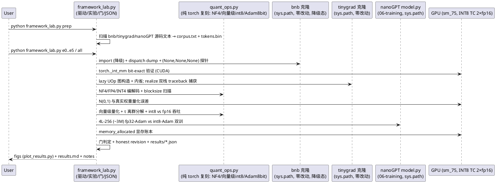
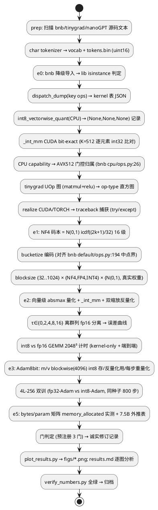

# 1 AR概述

| 组件名称 | quant-frameworks-lab（07-frameworks 学习实验室） |
| --- | --- |
| AR系统流水号 | AR007 |
| AR描述 | bitsandbytes 量化框架真机拆解：LLM.int8/NF4/8bit-Adam 纯 torch 复刻 + int8 TC 吞吐实测 + 降级 dispatch 机制解剖 + csrc sm_75 kernel 行号级拆解；辅线 tinygrad 图编译管线拆解与失败模式诚实记录。全链面向面试。 |

# 2 动态行为



# 3 功能点分解

| 序号 | 功能点名称 | 功能点描述 |
| --- | --- | --- |
| 1 | 语料构建 | bnb/tinygrad/nanoGPT 源码文本聚合 + char tokenizer + tokens.bin |
| 2 | E0 环境基线 | bnb 降级链 + dispatch dump + (None,None,None) 机制定位；_int_mm bit-exact；tinygrad UOp 内省 + realize 失败记录 |
| 3 | E1 NF4 | NF4/FP4/INT4 复刻 + 分位匹配证明 + blocksize 扫描 + 真实权重端到端 |
| 4 | E2 LLM.int8 | 向量级缩放 + τ 离群扫描 + int8 vs fp16 吞吐 + 缩放方式对比 |
| 5 | E3 8bit-Adam | blockwise int8 优化器状态复刻 + 双训对比 + 显存实测 |
| 6 | E5 显存账本 | bytes/param 全组合实测 + 7.5B 外推 |
| 7 | E4 源码拆解 | bnb-internals.md（dispatch/四算法/gemm_4bit_sm75.cu）+ tinygrad-internals.md（管线/失败点） |
| 8 | F5 面试笔记 | frameworks-notes.md 六段 + 题卡 + INTERVIEW-INDEX 增补 |
| 9 | 图表总装 | ≥11 图 + results.md 逐图分析 + README |
| 10 | 对账核查 | verify_numbers.py 文档-JSON 一致性 + 上游 mtime 零改动核查 |

# 4 实现设计

## 4.1 功能实现思路

- **上游零改动三导入**：bnb 与 tinygrad 克隆、nanoGPT model.py（06-training，
  AR006 已验证可跑）均经 `sys.path.insert` 导入；自研代码全部在
  `07-frameworks/frameworks-lab/`。bnb 仓库 CLAUDE.md 的 worktree/PR
  规则是贡献者工作流，只读拆解不适用（记录规避）。
- **方案取舍**：（A）复刻 bnb 算法 + 真机实测 + 行号级拆解【选定】；
  （B）直接调 bnb CUDA op【否——本机无 libbitsandbytes_cuda121.dll，
  降级态】；（C）只读不跑【否——用户要求深度用 GPU，且 int8 TC
  路径 torch._int_mm 已探针验证可用】。
- **降级即教学**：bnb 的 ErrorHandlerMock + torch.library 多后端注册 +
  "default" 纯 torch 兜底是「框架分发决策」的活样本；CPU 调用返回
  (None,None,None) 的确切机制用 `torch._C._dispatch_dump` 定位，
  结论进 E0 JSON 与 bnb-internals.md。
- **tinygrad 失败模式 = 诚实记录**：realize 在 CUDA 栈（hcq2.py:533
  encode）与 TORCH 栈（realize.py:236）双 StopIteration，全 traceback
  落 JSON；lazy UOp 图可构造可内省（不 realize），op-type 直方图是
  「图 IR」的实测数据。不修不绕（AR005 E7 惯例）。
- **计时纪律**（沿用 AR002-006）：burn-in 20 轮 + `torch.cuda.synchronize`
  + perf_counter；吞吐取中位数；WDDM 噪声用 ≥2048 维 GEMM 规避。

## 4.2 功能实现设计

### 4.2.1 流程图



### 4.2.2 关键算法设计

**NF4 编解码**（quant_ops.py，对齐 bnb 语义 [源码] functional.py:170-196
+ backends/default/ops.py:233-260）：
```
levels[k] = Normal().icdf((2k+1)/32), k=0..15   # 16 级分位匹配
blockwise absmax: scale[j] = max|W_blk[j]|, 块大小 b ∈ {32..1024}
bounds = (levels[:-1]+levels[1:])/2              # 中点界, 同 bnb L194
idx = bucketize(W/scale, bounds)                 # 4bit 索引
dequant: levels[idx] * scale
误差: rel-RMSE = ||W-Ŵ||₂ / ||W||₂（按张量与按块两种口径都记）
```

**向量级 int8 + 离群分解**（对齐 functional.py:1590-1671 +
default/ops.py:64-177）：
```
row_stats = absmax(A, dim=1); col_stats = absmax(B, dim=1)
CA = round(A × 127/row_stats); CB 同理
C_i32 = torch._int_mm(CA, CB.t())                 # CUDA INT8 TC
C = C_i32 × (row_stats ⊗ col_stats)/127²
离群: mask = |A| ≥ τ; cols = mask.any(0) 非零列
A_out = A[:, cols] fp16 路径; A[:, cols]=0 后走 int8
C = C_int8 + A_out @ B[cols].fp16                 # 稀疏补回
```

**Adam8bit**（对齐 functional.py 优化器路径 +
backends/cpu/ops.py:469-580 语义）：
```
每步: m̂ = m_q × m_absmax_blk; v̂ = v_q × v_absmax_blk  # 反量化
标准 Adam 更新 (fp32 params/grads)
m ← β₁m̂ + (1-β₁)g; v ← β₂v̂ + (1-β₂)g²
按 4096 块 absmax 重新量化存 int8                      # 重量化
```

**显存账本公式**（E5 实测互洽 ±10%）：
```
fp32 训练 = 16 B/param (P4+G4+M4+V4)
混合精度 = 14 B/param (P4 master+G2 fp16+M4+V4)
8bit 优化器 = 12 B/param (P4+G2+M1+V1+absmax≈0)
QLoRA 底座 = 0.53 B/param (NF4 0.5 + fp16 块缩放 2/64)
7.5B 外推 = bytes/param × 7.5e9（表格式代入）
```

### 4.2.3 数据结构（JSON 落盘约定）

```
results/e0_env.json   { bnb_version, degraded:bool, lib_class, dispatch_table:{op:{keys:[...]}},
                        cpu_capability, avx512:bool, int_mm_cuda_bitexact:bool,
                        int_mm_cuda_err_max:0, tinygrad_uop:{nodes,op_hist:{...}},
                        realize_fail:{cuda_tb, torch_tb} }
results/e1_nf4.json   { levels:{nf4:[...],fp4:[...],int4:[...]}, bnb_map_consistent:bool|null,
                        synth:{method×blocksize: rel_rmse}, weights:{...}, gate_nf4_vs_int4:bool }
results/e2_llmint8.json{ uniform_err, threshold_sweep:{tau: {rel_err, outlier_frac, cols}},
                         throughput:{2048:{fp16_tf, int8_kernel_tf, int8_e2e_tf, ratio_kernel, ratio_e2e}},
                         scaling:{tensor,row,rowcol: rel_err}, gate_int8_ratio:bool }
results/e3_adam8bit.json{ steps, final_loss_fp32, final_loss_int8, loss_curves:[...],
                          optim_mem_bytes:{fp32,int8}, step_ms:{fp32,int8}, gate_loss_diff:bool }
results/e5_ledger.json { measured_bytes_per_param:{...}, theory:{...}, consistency_pct:{...},
                         proj_7p5b:{...} }
所有 JSON 含 seed / timestamp / torch_version / gpu 名 与 honest_note 字段
```

## 5 预注册门与诚实修订

| 门 | 判定 | 不达时 |
| --- | --- | --- |
| G1 NF4 优于 INT4 | N(0,1) 上 NF4 rel-RMSE < INT4 | 如实分析（NF4 最优性依赖权重分布——面试素材） |
| G2 int8 吞吐 | kernel-only ≥ 1.2× fp16 @2048³ | 记录 WDDM/量化开销分解，修订口径 |
| G3 8bit-Adam | 终值 loss 差 < 0.05 | 分析量化噪声对二阶矩估计的影响 |
| G5 账本互洽 | 实测 vs 理论 ±10% | 找 allocator 对齐/碎片原因 |

## 6 风险与对策

| 风险 | 对策 |
| --- | --- |
| tinygrad UOp 内省 API 与预期不符 | dev 时先 5 行探针确认属性名（uop.op/uop.src），只依赖不 realize 的路径 |
| bnb 码本导入失败（私有 API） | 自算 icdf 分位码本为主，bnb 常量导入成功则做一致性交叉，失败记 null |
| _int_mm 对形状有约束（K 对齐） | 尺寸取 64 倍数；非对齐形状行为不测 |
| int8-Adam 慢导致超时 | 800 步 3M 模型 fp32 ≈1 分钟量级，预算 8 分钟内含双跑 |
| WDDM 计时噪声 | 中位数 + 50 轮 + 大 GEMM（沿用纪律） |
| 文档数字与 JSON 漂移 | verify_numbers.py 逐项断言（AR005 review 教训） |
